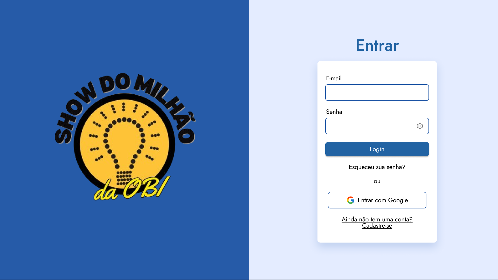
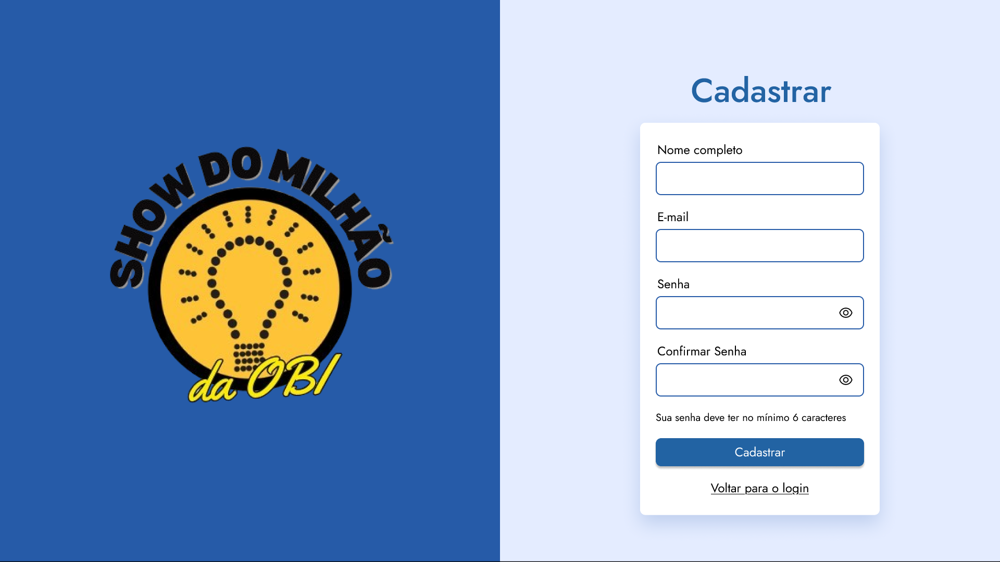
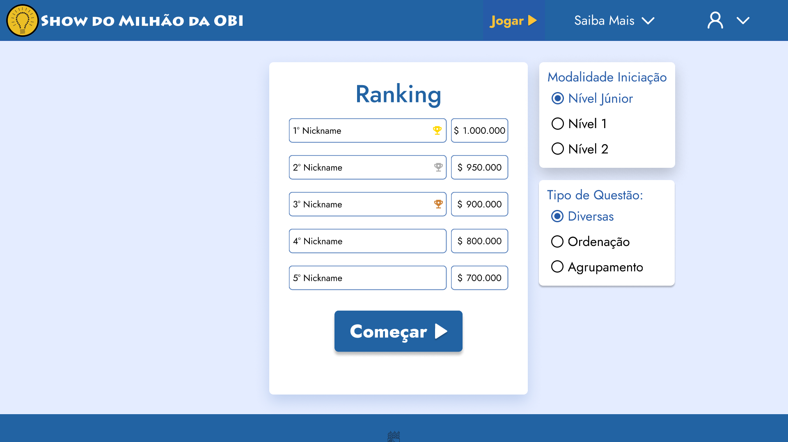
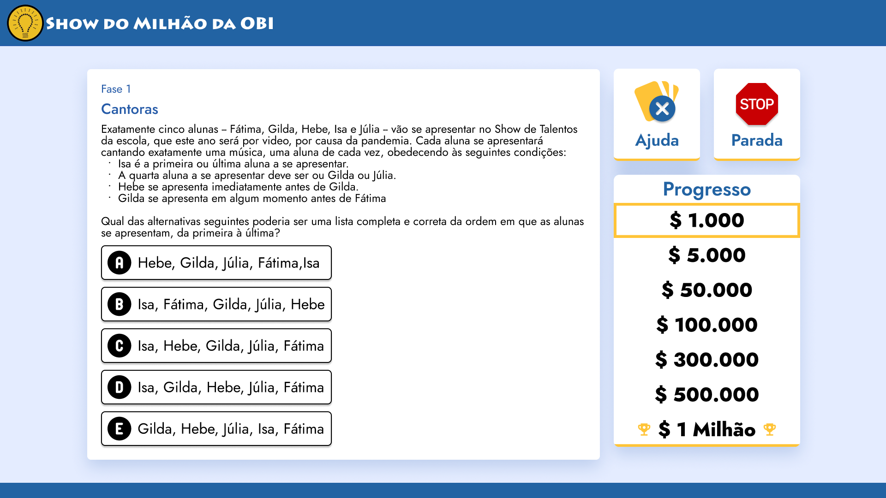
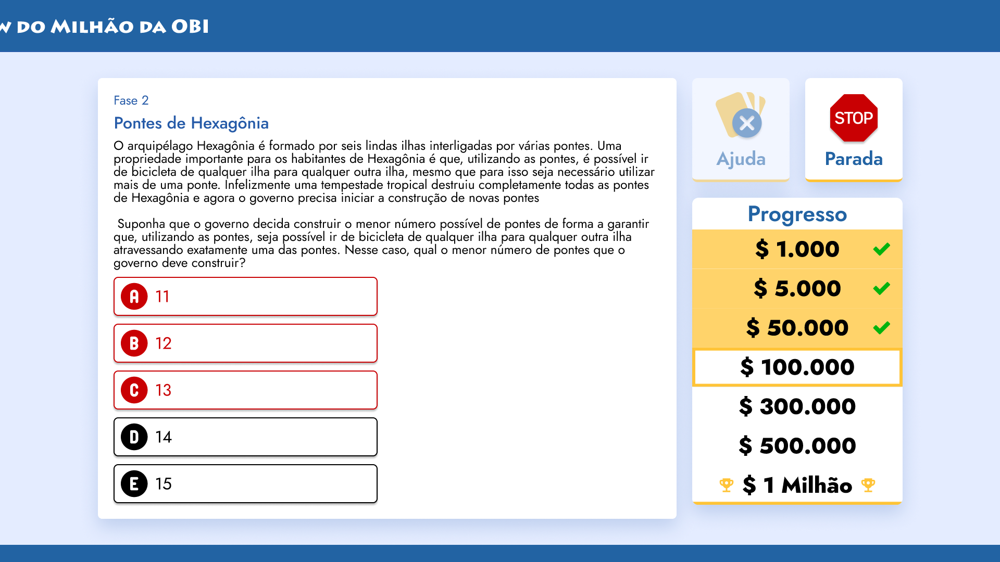
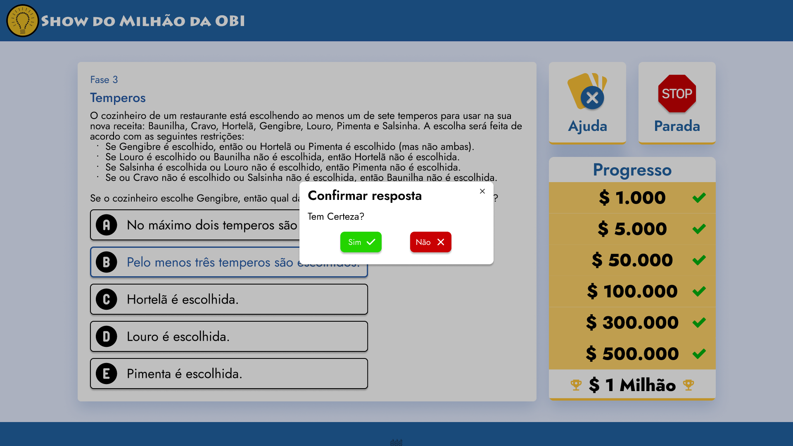
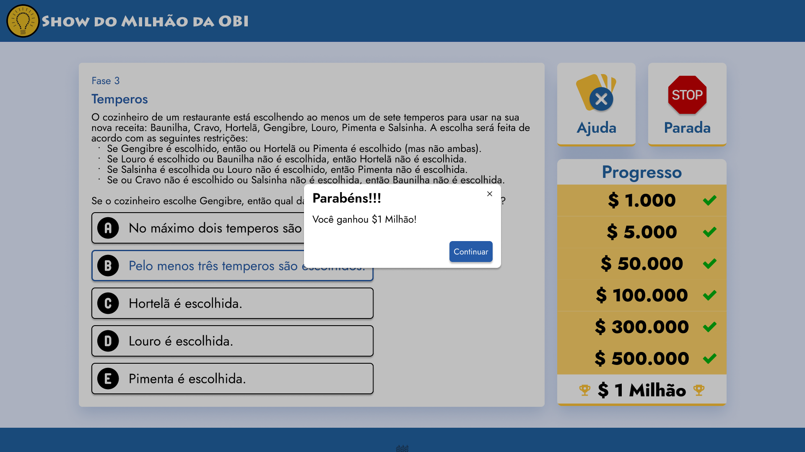
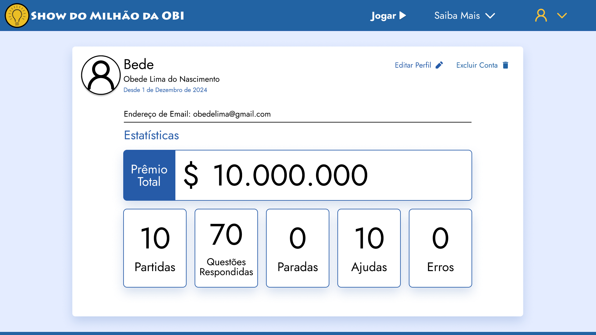
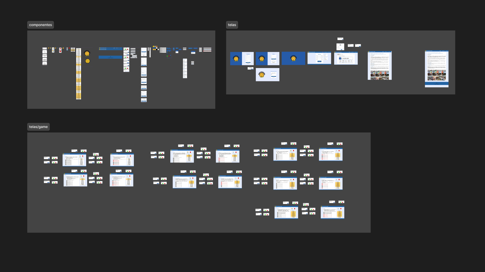
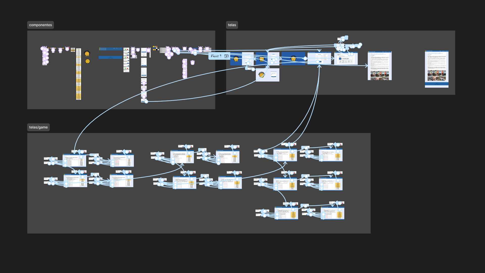

# Show do Milhão da OBI

Uma plataforma educativa inspirada no clássico "Show do Milhão", criada para tornar a preparação para a Olimpíada Brasileira de Informática (OBI) mais engajante e divertida.

---

## O Problema

Praticar questões da OBI pode ser eficaz, mas também cansativo. A repetição de exercícios sem nenhuma camada de motivação torna o estudo pouco atrativo, especialmente para estudantes que estão começando.

---

## A Proposta

Transformar a resolução de questões em uma experiência gamificada: o estudante avança por níveis, recebe feedback imediato e sente a progressão, como num jogo de verdade.

---

## Processo de Design

**1. Pesquisa e Referência**

Parti do formato original do Show do Milhão para entender o que faz o jogo funcionar: a tensão da progressão, o feedback claro após cada resposta e a sensação de conquista a cada nível superado. Esses elementos guiaram todas as decisões de design.

**2. Wireframes**

Os wireframes de baixa fidelidade focaram em três prioridades: navegação simples, leitura fácil das perguntas e destaque visual nas opções de resposta. Nada que distraísse do que importa.

**3. Protótipo de Alta Fidelidade**

No Figma, os wireframes evoluíram para uma interface com hierarquia visual definida, feedbacks visuais pensados e consistência entre as telas.

**4. Testes de interface, ajustes e melhorias**

Após a validação do protótipo inicial, ajustes e melhorias foram aplicados ao modelo para adequar algumas funcionalidades e aprimorar o fluxo do usuário.

---

## Solução

A interface final simula a progressão do jogo original, com foco em clareza, engajamento e uma experiência que incentiva o estudante a continuar.

---
## Ferramentas

Figma

---

## Aprendizados

Esse projeto me mostrou na prática como a gamificação pode transformar uma experiência de estudo. Adaptar um formato já consolidado para um novo contexto exige mais do que copiar a estética, é preciso entender *por que* aquele formato funciona, e aí sim traduzir isso para o novo objetivo.

---

## Telas

---
